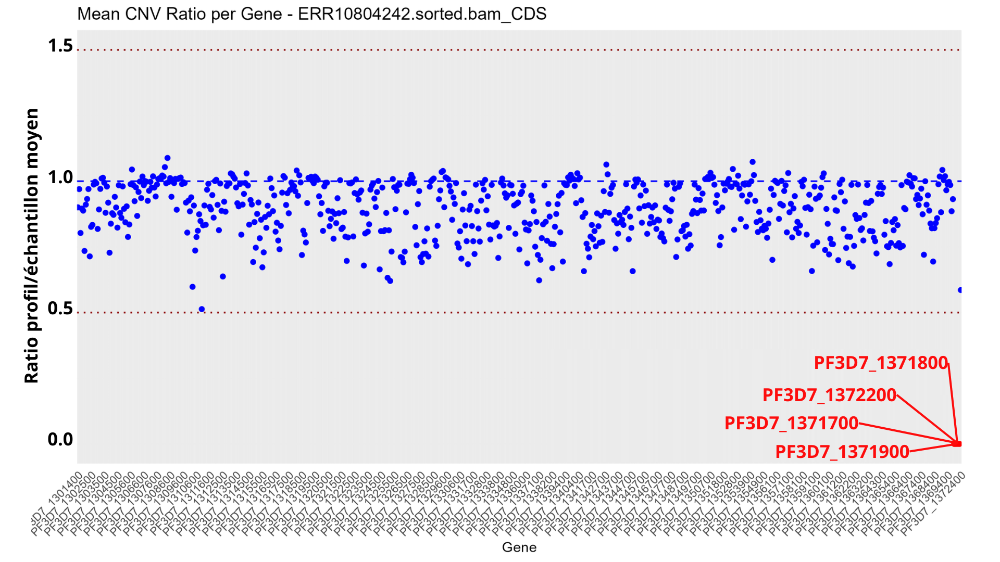
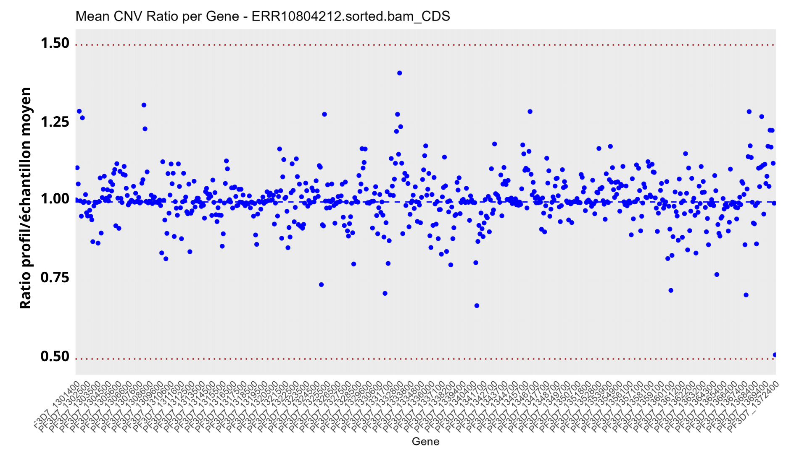
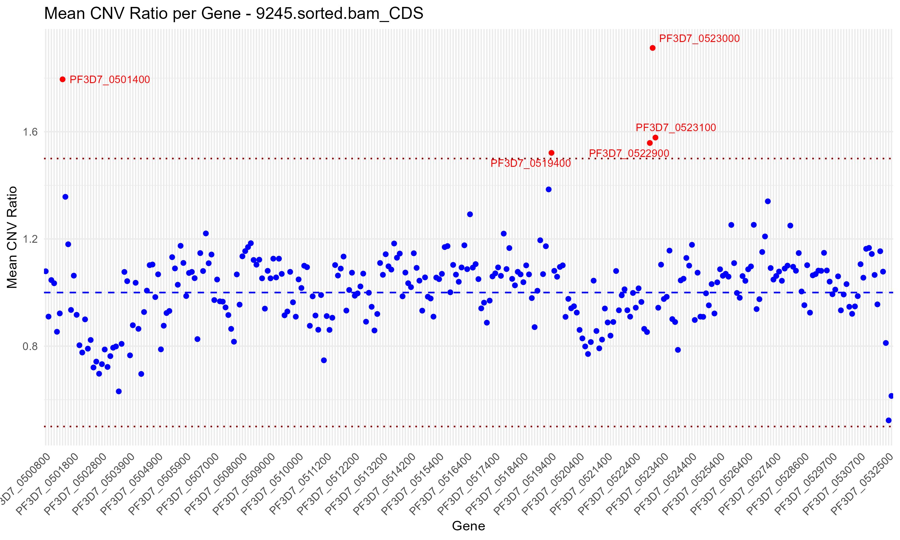
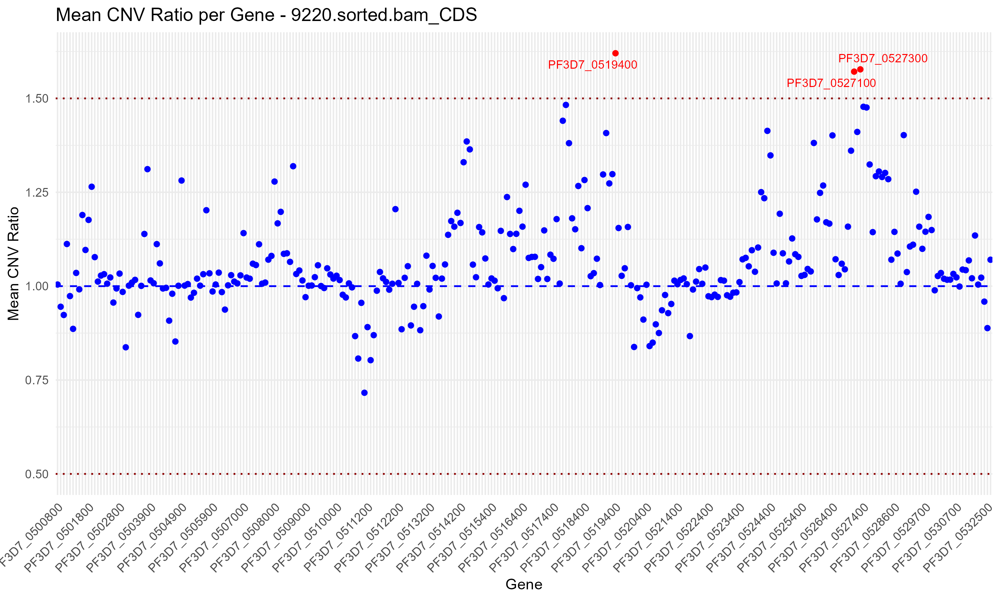

# SWGACNV

`SWGACNV` is an R package designed to facilitate Copy Number Variation (CNV) detection from data 
generated through SWGA sequencing, specifically in malaria-related studies. 

## Installation

To install this package and its dependencies on Windows, you may need to install [Rtools](https://cran.r-project.org/bin/windows/Rtools/).
Make sure Rtools is properly installed and available in your system PATH.

You can install the development version of SWGACNV like so:

``` r
install.packages("devtools")
devtools::install_github("Rocamadourr/SWGACNV")

```


## Function Overview

### `bam_to_csv()`

Converts a folder of BAM files issued from SWGA sequencing and aligned with GATK into CSV files formatted for CNV analysis.
It can also be done manually with [`SAMtools`](http://www.htslib.org/).

#### **Parameters:**

- `bam_folder`: Path to the folder containing the BAM files issued from SWGA.
- `output_folder`: *(optional)* Path to the output folder. Defaults to the working directory if not provided.
- `min_coverage` : *(optional)* Minimum read depth to keep a position. Default is 5.

#### **Output:**

A `.csv` file for each BAM input, containing 3 columns :
- `seqnames` (Chromosome ID.)
- `pos` (Position in the chromosome.)
- `count` (Number of reads.)

These CSV files should then be cleaned using the `cds_cleaning()` function for better results.

### `cds_cleaning()`

Cleans coverage CSV files by removing non-coding regions, keeping only coding sequences (CDS) of the genome.
This function is optional but we strongly recommend using it after the `bam_to_csv` function to eliminate any background noise from non-coding region of the genome.

#### **Parameters:**

- `csv_folder`: Path to the folder containing samples CSV files converted from BAM. Each file must include at least the following columns: `seqnames`, `pos`, and `count`.
- `gff_path`: Path to the reference GFF file (e.g., from [MalariaGEN](https://www.malariagen.net/data_package/open-dataset-plasmodium-falciparum-v70/) under the section "annotation").
- `output_folder`: *(optional)* Path to the output folder. Defaults to the working directory if not provided.

#### **Output:**

A `.csv` file per sample, containing the same columns as before but only for the CDS of the genome.
These CSV files should then be used as input for the `cnv_analysis()` or `create_profile()` function.

### `create_profile()`

Generates SWGA profiles from multiple coverage CSV files for comparison during the CNV analyze with the `cnv_analysis()` function.
The input files should come from the `cds_cleaning()` function and the samples used to create the profile should be different than the one analyzed with `cnv_analysis()`..

#### **Parameters:**

- `profile_csv_folder`: Path to a folder containing the CSV files. Each file should have 3 columns: `seqnames`, `pos`, and `count`.
- `chromosome` : *(optional)* Vector of chromosome numbers to analyze (e.g., c(1, 2, 3)). Defaults to 1:14.
- `gene_position` *(optional)* Path to the file containing each gene to analyze with their start and end. It should have 3 column : `gene`, `start`, `end`.
- `output_folder`: *(optional)* Path to the folder where the profile files will be saved. Defaults to the working directory if not provided.

#### **Output:**

Creates one profile file per chromosome (e.g., `profile01.csv`, `profile02.csv`, ..., `profile14.csv`).
These files are a matrix containing the ratio of each gene's AUC (row) divided by the 10 most stable gene's AUC (column).


These profiles are to be used with the `cnv_analysis()` function for CNV detection.


### `cnv_analysis()`

Performs CNV detection by comparing new SWGA samples to a reference profile created using `create_profile()`.

#### **Parameters:**

- `csv_folder`: Path to the folder containing sample CSV files with columns: `seqnames`, `pos`, and `count`.
- `chr`: ID of the chromosome to analyze (e.g., `"Pf3D7_01_v3"`, `"Pf3D7_02_v3"`...,`"Pf3D7_14_v3"`).
- `mean_profile` : Vector of integer containing the mean AUC for each chromosome. Returned by create_profile() and used for standardization.
- `gene_position` : *(optional)* Path to the file containing each gene to analyze with their start and end. It should have 3 column : `gene`, `start`, `end`. Default to the one provided with the package.
- `profile_folder` *(optional)* Path to the folder which contains a profile. This is useful if you want analyze your own sample against your own profile.
- `output_folder`: *(optional)* Path to the folder where the results will be saved. Defaults to the working directory if not provided.

#### **Output:**

- A CSV file with a matrix of the new sample ratio compared to profile ratio for each genes on the 10 most stable genes.
  This way we can compare how the ratio is to how it should be with no CNV.
  A higher ratio indicates greater gene expression relative to the profile while a lower ratio suggest the opposite.
- One JPG plot per sample per showing CNV highlights with gene-level annotations.

These results help identify amplifications or deletions in sample genomes based on ratios (typically > 1.5 or < 0.5).


## Exemple

```r

install.packages("devtools")
devtools::install_github("Rocamadourr/SWGACNV")
library(SWGACNV)

# Step 1: Convert BAM files to coverage CSV
bam_folder <- "data/bam_files"
csv_folder <- "data/csv_files"

bam_to_csv(bam_folder = bam_folder, output_folder = csv_folder)

# Step 2: Clean the CSV by keeping only the CDS
gff_path <- "data/Pfalciparum_annotation.gff"
csv_cleaned <- "data/csv_files/csv_cleaned"
cds_cleaning(csv_folder = csv_folder, gff_path = gff_path, output_folder = csv_cleaned)
# Split the cleaned csv between reference files (data/ref_csv_folder) and the one you want to analyse (data/new_samples_csv_folder).

# Step 3: Create a reference profile from coverage data
profile_csv_folder <- "data/ref_csv_folder"
output_path <- "results/profiles"

mean_profile <- create_profile(profile_csv_folder, output_path)

# Step 4: Detect CNVs in new samples
samples_folder <- "data/new_samples_csv_folder"
output_folder <- "data/results"

for (i in 4:5){
  chromosome <- paste0("PF3D7_", sprintf("%02d", i), "_V3")
  cnv_analysis(csv_folder, chromosome, mean_profile, profile_folder, output_folder)
}

```

## Results


  
*Figure 1: Example of HRP3 deletion (PF3D7_1372200).*

To test the tool in the case of a deletion, we targeted the HRP3 gene, which is involved in false negatives during malaria rapid diagnostic tests.  
We collected samples in Gambia at the same time. Using qPCR, a deletion of the HRP2 gene was identified in some samples but not in others.  
The figure above (Fig. 1) was generated by the package after analyzing a sample with an HRP3 deletion (PF3D7_1372200). We can observe that this gene, as well as its neighboring genes, show ratios close to 0, indicating a deletion.  

---

  
*Figure 2: Example without HRP3 deletion (PF3D7_1372200).*

The figure above (Fig. 2) was generated after analyzing a sample without an HRP3 deletion (PF3D7_1372200).  
We can observe that no gene shows a significant ratio, indicating that there is no deletion of HRP3, as expected.  

---

  
*Figure 3: Example of MDR1 duplication (PF3D7_0523000).*

To test the tool in the case of a duplication, we targeted the MDR1 gene, which is responsible for resistance to mefloquine and various Artemisinin-based Combination Therapies (ACTs).  
Samples were collected at the same time. Using qPCR, a duplication of the MDR1 gene was identified in some samples but not in others.  
The figure above (Fig. 3) was generated by the package after analyzing a sample with an MDR1 duplication (PF3D7_0523000). We can observe that this gene, as well as its neighboring genes, show ratios above the 1.5 threshold, indicating a duplication.  
Two other genes (PF3D7_0501400 and PF3D7_0519400) also exceed this threshold; they may also be duplicated, or this could be due to background noise.  

---

  
*Figure 4: Example without MDR1 duplication (PF3D7_0523000).*

The figure above (Fig. 4) was generated after analyzing a sample without an MDR1 duplication (PF3D7_0523000).  
We can observe that no gene shows a significant ratio, indicating that there is no duplication of MDR1, as expected.  
However, some other genes exceed the threshold; they may also be duplicated, or this could be due to background noise.  

## Dependencies

This package depends on:

- `Rsamtools`
- `GenomicRanges`
- `GenomicFeatures`
- `txdbmaker`
- `IRanges`
- `dplyr`
- `pracma`
- `tools`
- `utils`
- `ggplot2`
- `ggrepel`
- `rtracklayer`
-	`S4Vectors`

## Author

Created by Noé MATHIEUX, Yanis MEZIANI and Romain COPPÉE.  
GitHub: [Noé MATHIEUX](https://github.com/noemathieux)
